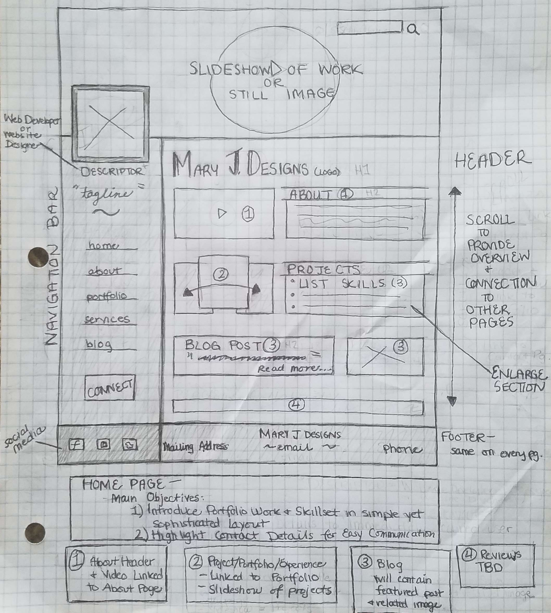
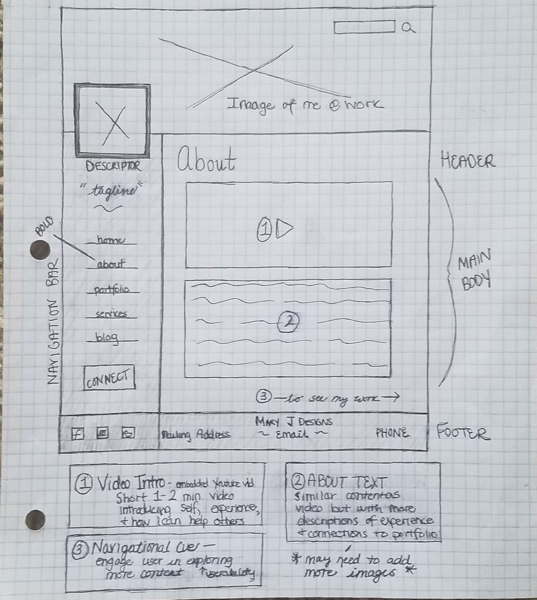
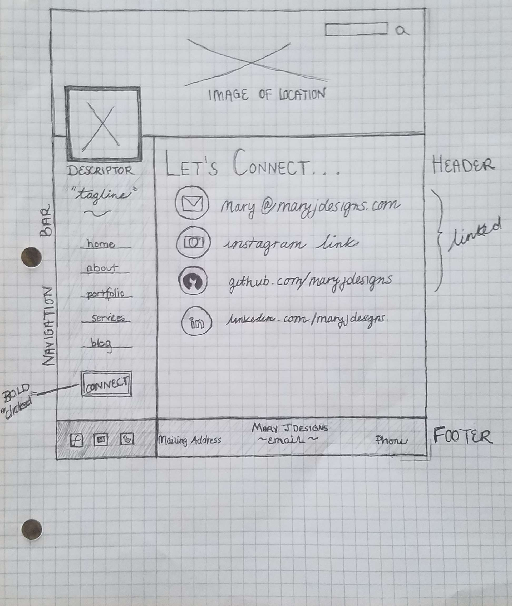

# My INFO 7420 Project

I will develop an online professional portfolio to display my undergraduate, graduate, and professional work. The main purpose of this site is effectively and attractively highlight my work for prospective jobs or consultancy work.

## WIREFRAMES

In order to effectively build my portfolio, I have developed multiple wireframes to help organize the content of my portfolio and develop a consistent structure across all pages.

This is one proposed layout that seems  simple yet sophisticated and may allow for optimal engagement by the user.

### Landing Page
The landing page that all users will first see provides an overview of the different content throughout the portfolio and provides easy-use-tools for communicating.

Header - will include name (Mary J) and logo

Navigation Menu - will include links ot other pages (about, portfolio, contact, etc.) and will also be positioned as a bar on the left side.

Main Content- will provide overview of the different types of content on page including a brief purpose statement and links to each page.

Footer - will include contact information, social media links, and copyright information

### About Page
This page will provide a quick video and written introduction to who I am, what I have done, and what I can do for other information organizations.

Header - will include title of page (About) and logo

Navigation Bar - will be a vertical bar on leftside with links to each page (home/landing page, contact, portfolio, etc.)

Main Content - will include a short 1-2 minute video introduction as well as text description of who I am and what I do.

Footer - will include contact info, social media, and copyright information

### Contact Page
This page will allow users to connect with me using whichever communication platform they prefer.

Header - will include title of page (Let's Connect) and logo

Navigation Menu - will be a vertical bar on leftside with links to each page (home/landing page, contact, portfolio, etc.)

Footer - will include contact info, social media, and copyright information
